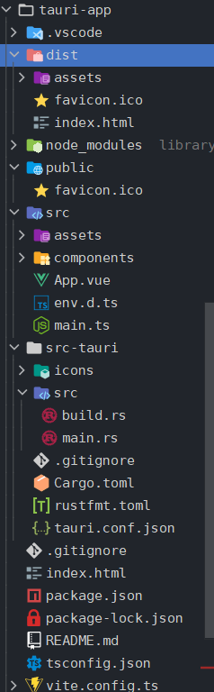
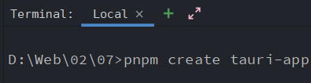
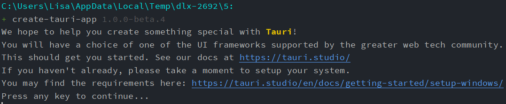
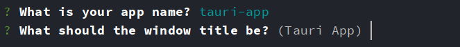
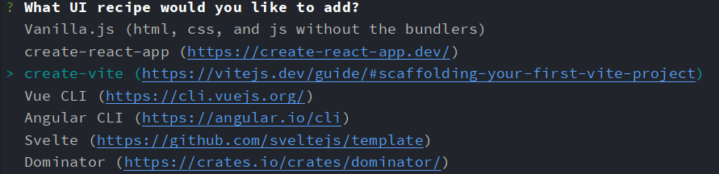
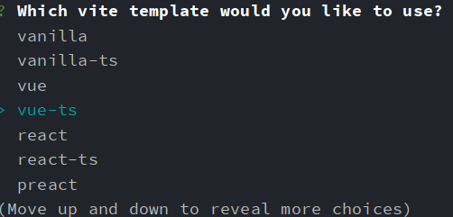
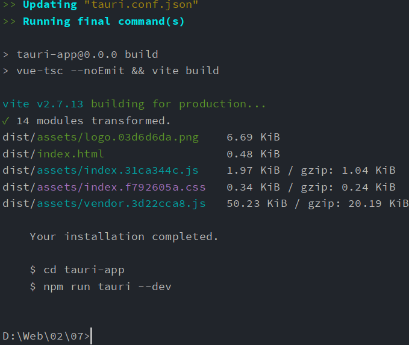
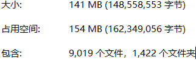

# Vue 3 + Typescript + Vite + Tauri

> 本文主要使用 [pnpm](https://www.npmjs.com/package/pnpm) 来进行管理软体包,但附带其它包管理器的操作步骤,看你用的包管理器操作步骤即可
>
> 国内推荐使用 [nrm](https://www.npmjs.com/package/nrm) 来切换源
>

更新次数
> 1.0.0

基本结构:



## 常见错误

- 安装卡在 ```Download Rust CLI...```

> 原因: 目前安装需要从github上下载对应的Rust CLI包,国内地址不容易上github拉取文件
>
> 第一次安装概率会失败

解决方案:

- 换源,安装 [nrm](https://www.npmjs.com/package/nrm)
    - ```nrm -v``` 查看安装是否成功/查看版本
    - ```nrm ls``` 查看现有的源
    - ```nrm test <registry>``` 测试现有的源 url 是列表提供的源
    - ```nrm use <registry>``` 根据 测试的源,选择一个最合适的进行安装
    - 重新运行 ```pnpm install tauri``` 最好把下载失败的包删掉,重新安装,或者新建一个文件夹

- 使用 [npx](https://docs.npmjs.com/cli/v7/commands/npx/) 来安装

```npx create-tauri-app```

- 打包失败

> 可能原因: 别名配置有问题(如果有),安装以下的配置进行进行对应配置即可

## 安装

```nvm use latest```

### Tauri运行环境安装

本文以 Windows 操作系统来安装
> [MacOS](https://tauri.studio/docs/get-started/setup-macos)
>
> [Linux](https://tauri.studio/docs/get-started/setup-linux)

1. 安装 [C++](https://win.rustup.rs/x86_64) 构建工具,选择**C++生成工具** 与 **Windows SDK**
2. 安装[Node](https://nodejs.org/en/)

> 建议使用最新的 [Node](https://nodejs.org/en/) 版本来安装
>
> 建议使用NVM [nvm for windows](https://github.com/coreybutler/nvm-windows) 来切换Node版本

3. 安装 [WebView2](https://developer.microsoft.com/en-us/microsoft-edge/webview2/#download-section)

> Window 11 系列版本内置

4. 重启电脑

5. 安装**tauri**


```
pnpm create tauri-app
or
yarn create tauri-app
or
npx create-tauri-app
```
6. 按回车继续操作



输入App的名称和App标题



7. 询问安装什么框架 -> create-vite



是否安装它的api -> y


8. 选择项目模板 -> vue-ts



9. 是否要安装tauri/api -> yes

安装成功图

10. 初始化 **tauri**,在项目根目录下运行:

```
pnpm tauri init
or
yarn tauri init
or
npm run tauri init
 ```

11. 检查

```
pnpm tauri info
or
yarn tauri info
or
npm run tauri info
 ```

安装成功之后的近似大小:



154 MB (162,349,056 字节)

9,019 个文件，1,422 个文件夹

若成功安装会输出以下大体内容(内容会与你的配置相关):

```
Operating System - Darwin(16.7.0) - darwin/x64

Node.js environment
  Node.js - 12.16.3
  @tauri-apps/cli - 1.0.0-beta.2
  @tauri-apps/api - 1.0.0-beta.1

Global packages
  npm - 6.14.4
  yarn - 1.22.4

Rust environment
  rustc - 1.52.1
  cargo - 1.52.0

App directory structure
/node_modules
/src-tauri
/src
/public

App
  tauri.rs - 1.0.0-beta.1
  build-type - bundle
  CSP - default-src blob: data: filesystem: ws: wss: http: https: tauri: 'unsafe-eval' 'unsafe-inline' 'self' img-src: 'self'
  distDir - ../public
  devPath - ../public
  framework - Svelte
  bundler - Rollup
```

项目根目录运行:

```
pnpm tauri info 
```

## 使用

运行Vue项目

```
pnpm dev 
or
yarn dev
or
npm run dev
```

运行Tauri项目

```
pnpm tauri dev 
npm run tauri dev 
yarn tauri dev 
```

## 配置

> tsconfig.json:

```json

{
  "skipLibCheck": true,
  "paths": {
    "@/*": [
      "./src/*"
    ],
    "/images/*": [
      "./public/images/*"
    ]
  }
}
```

> vite.config.ts
> 根据项目需要配置

```ts
import { defineConfig } from 'vite'
import vue from '@vitejs/plugin-vue'
import { resolve } from 'path' // 引入Node,配置别名

export default defineConfig(( { command } ) => {
	// 开发环境配置
	if ( command === 'serve' ) {
		return {

			plugins: [vue()],
			resolve: {
				// 别名
				alias: [
					{ find: '@', replacement: resolve(__dirname, 'src') + '/' }, // src 目录下
					{ find: 'images', replacement: resolve(__dirname, 'public/images') + '/' }, // 图片文件夹
				],
				extensions: ['.js', '.ts', '.json'], // 引入时忽略的文件扩展名列表
			},

		}
	}

	// 生产环境配置
	else {
		return {

			base: './', // 路径
			plugins: [vue(),
				// element-plus	start
//				styleImport({
//					libs: [{
//						libraryName: 'element-plus',
//						esModule: true,
//						ensureStyleFile: true,
//						resolveStyle: ( name ) => {
//							name = name.slice(3)
//							return `element-plus/packages/theme-chalk/src/${ name }.scss`
//						},
//						resolveComponent: ( name ) => {
//							return `element-plus/lib/${ name }`
//						},
//					}],
//				}),
				// element-plus end
			],
			resolve: {
				alias: [
					{ find: '@', replacement: resolve(__dirname, 'src') + '/' },
					{ find: 'images', replacement: resolve(__dirname, 'public/images') + '/' },
				],
			},

			// 服务
			server: {
				// 代理, 解决前端跨域
				proxy: {
					'/api': {
						target: 'https://localhost:8080',
						changeOrigin: true,
						rewrite: path => path.replace(/^\/api/, ''),
					},
				},
			},

			build: {

				sourcemap: false, // 是否构建source map 文件
				output: 'dist', // 打包输出目录
				assetsDir: 'assets', // 静态文件存放路径
				cssCodeSplit: true, //css代码拆分, 禁用则存放在一个css
				minify: 'terser',
				terserOptions: {
					// 生产环境输出
					compress: {
						drop_debugger: true, // 移除生产环境的Debug
						drop_console: true, // 移除生产环境的控制台输出
					},
				},

				server: {
					https: true,
					proxy: {
						'/api': {
							target: 'https://localhost:8080',
							changeOrigin: true,
							rewrite: path => path.replace(/^\/api/, ''),
						},
					},
				},
			},

			rollupOptions: {
				// 输出目录
				output: {
					chunkFileNames: 'js/[name]-[hash].js', // 出口文件
					entryFileNames: 'js/[name]-[hash].js', // 入口文件
//					assetFileNames: '[ext]/[name]/[hash].[ext]', // 静态文件

					manualChunks: {
						'element-plus': ['element-plus'],
						echarts: ['echarts'],
					},
				},
			},

			chunkSizeWarningLimit: 600, //chunk 大小警告的限制（以 kbs 为单位）
		}
	}
})
```